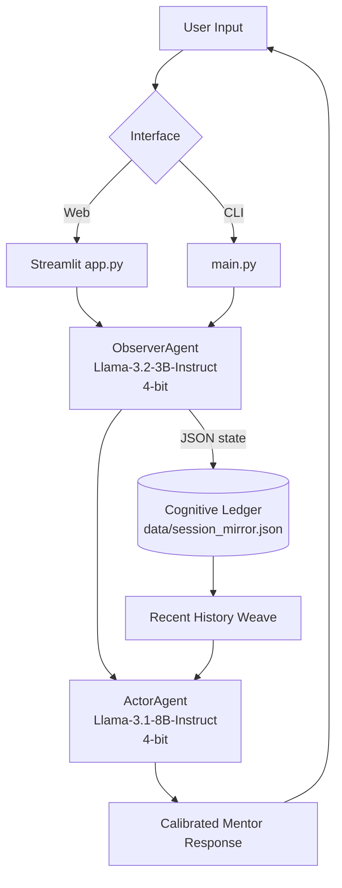

# MIRROR LLM 🪞

[](LICENSE)
[](https://github.com/abhi8667/mirror_llm/releases)
[](https://github.com/abhi8667/mirror_llm/actions)
[](https://github.com/abhi8667/mirror_llm/actions)
[](https://github.com/abhi8667/mirror_llm)
[](README.md)
[](https://github.com/abhi8667/mirror_llm/stargazers)
[](https://github.com/abhi8667/mirror_llm/network/members)
[](https://github.com/abhi8667/mirror_llm/issues)
[](https://github.com/abhi8667/mirror_llm/pulls)

**A local, dual-agent mentorship system that analyzes user cognitive state and generates calibrated responses on consumer GPUs.**

MIRROR LLM is a privacy-first AI application built around a sequential “Shadow Loop”: a lightweight **Observer** model performs structured state extraction (load, vibe, knowledge gaps), and a larger **Actor** model uses that state to produce context-aware responses.

The project is optimized for 6GB VRAM NVIDIA hardware using Unsloth 4-bit quantization, explicit VRAM cache management, and strict sequential inference. All session data remains local in a JSON ledger.

---

## Table of Contents

- [Overview](#overview)
- [Key Features](#key-features)
- [Architecture](#architecture)
- [Tech Stack](#tech-stack)
- [Getting Started](#getting-started)
- [Usage](#usage)
- [Project Structure](#project-structure)
- [Configuration](#configuration)
- [Roadmap](#roadmap)
- [Contributing](#contributing)
- [FAQ](#faq)
- [License](#license)

---

## Overview

### Problem Statement
Most local assistants produce generic responses and do not explicitly reason about user cognitive context turn-by-turn.

### Why MIRROR Exists
MIRROR introduces a two-model architecture where cognitive analysis is isolated from response generation. This separation provides better controllability, interpretability, and resource efficiency compared to a single monolithic prompt loop.

### Intended Users
- Developers building local-first AI systems
- Researchers exploring theory-of-mind-inspired interaction loops
- Students learning practical multi-agent orchestration
- Builders targeting low-VRAM deployment constraints

### Real-World Applications
- Educational assistants with adaptive teaching tone
- Coaching copilots with per-turn strategy injection
- Human-in-the-loop experimentation for cognitive personalization

> [!NOTE]
> Repository: https://github.com/abhi8667/mirror_llm

---

## Key Features

### Core Features
- Sequential dual-agent pipeline: **Observer (3B)** → **Actor (8B)**
- Structured observer output (`knowledge_gap`, `load_score`, `vibe`, `strategy_instruction`)
- Local persistence via chronological cognitive ledger (`data/session_mirror.json`)
- Streamlit “glass box” UI and CLI interface

### Advanced Features
- 4-bit quantized inference with Unsloth + bitsandbytes
- Explicit VRAM safety controls (`torch.cuda.empty_cache()` + `gc.collect()`)
- Recent-history weaving for response calibration
- Observer JSON extraction fallback handling for robust local model outputs

### Developer Experience
- Simple Python project layout
- Prompt files separated from orchestration logic
- Built-in project reset utility (`submission_prep.py`)
- Lightweight VRAM diagnostic (`src/vram_monitor.py`)

---

## Architecture



### Runtime Flow
1. Capture user input from Streamlit or CLI.
2. Run Observer inference and extract structured cognitive state.
3. Retrieve recent history from ledger.
4. Inject strategy + history into Actor system prompt.
5. Generate response and append snapshot to ledger.

---

## Tech Stack

| Layer | Technology |
|---|---|
| Language | Python |
| LLM Runtime | Unsloth, Transformers-compatible model loading |
| Models | Llama-3.2-3B-Instruct (Observer), Llama-3.1-8B-Instruct (Actor) |
| Quantization | bitsandbytes 4-bit |
| UI | Streamlit |
| Compute | PyTorch + CUDA |
| Config | python-dotenv |
| Storage | Local JSON ledger |

---

## Getting Started

### Prerequisites

| Requirement | Minimum |
|---|---|
| Python | 3.10+ |
| GPU | NVIDIA CUDA-capable GPU (tested on 6GB VRAM RTX 4050) |
| CUDA | 11.8+ recommended |

### Installation

```bash
git clone https://github.com/abhi8667/mirror_llm.git
cd mirror_llm
python -m venv .venv
source .venv/bin/activate  # Windows: .venv\Scripts\activate
pip install -r requirements.txt
python submission_prep.py
```

> [!TIP]
> If Unsloth/bitsandbytes installation fails for your CUDA version, follow the upstream installation matrix in the Unsloth documentation.

---

## Usage

### Run Web UI (recommended)

```bash
streamlit run app.py
```

### Run CLI

```bash
python main.py
```

### Run VRAM Monitor

```bash
python src/vram_monitor.py
```

### Basic User Flow Checklist
- [x] Initialize ledger with `submission_prep.py`
- [x] Start either Streamlit or CLI interface
- [x] Send prompt and inspect Observer state
- [x] Review calibrated Actor response
- [x] Reset session when needed

---

## Project Structure

```text
mirror_llm/
├── app.py                     # Streamlit dashboard
├── main.py                    # CLI orchestrator
├── requirements.txt
├── submission_prep.py         # Sanity/reset utility
├── prompts/
│   ├── observer_v1.txt
│   └── actor_base.txt
├── src/
│   ├── agents.py              # Observer + Actor agents
│   ├── storage_manager.py     # Ledger persistence/context retrieval
│   └── vram_monitor.py        # GPU memory diagnostics
└── documents/                 # Demo and judge-facing docs
```

---

## Configuration

Optional `.env` support is enabled via `python-dotenv`.

```env
HF_TOKEN=your_huggingface_token
```

Use this only when required for gated model access.

---

## Roadmap

- [ ] Add automated tests for `StorageManager` and observer JSON parsing
- [ ] Add CI workflow for lint/test checks
- [ ] Add model/config abstraction for easier model swaps
- [ ] Add export/import tooling for session ledgers

---

## Contributing

Contributions are welcome.

1. Fork the repository.
2. Create a feature branch.
3. Keep changes focused and well-scoped.
4. Validate behavior locally.
5. Open a pull request with clear technical context.

For substantial changes, open an issue first to align on direction.

---

## FAQ

**Why two models instead of one?**  
The design separates analysis from generation to improve controllability and interpretability.

**Does data leave my machine?**  
By default, session history is stored locally in `data/session_mirror.json`.

**Can this run on lower-end GPUs?**  
The implementation targets 6GB VRAM using sequential inference and cache purging; lower-memory devices may require model substitutions.

---

## License

This repository is licensed under the terms declared in the project license file.
